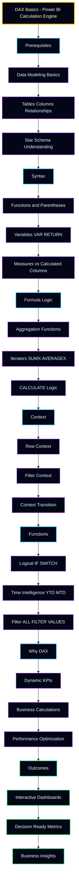

```mermaid
flowchart TB
    %% ============ THEME ============
    classDef core fill:#020617,stroke:#facc15,stroke-width:3px,color:#fef3c7
    classDef section fill:#020617,stroke:#38bdf8,stroke-width:2px,color:#e5e7eb
    classDef step fill:#020617,stroke:#a855f7,stroke-width:1.5px,color:#e0e7ff
    classDef output fill:#020617,stroke:#22c55e,stroke-width:2px,color:#dcfce7

    %% ============ ROOT ============
    A[DAX Basics - Power BI Calculation Engine]:::core

    %% ============ PREREQUISITES ============
    A --> B[Prerequisites]:::section
    B --> B1[Data Modeling Basics]:::step
    B1 --> B2[Tables Columns Relationships]:::step
    B2 --> B3[Star Schema Understanding]:::step

    %% ============ SYNTAX ============
    B3 --> C[Syntax]:::section
    C --> C1[Functions and Parentheses]:::step
    C1 --> C2[Variables VAR RETURN]:::step
    C2 --> C3[Measures vs Calculated Columns]:::step

    %% ============ FORMULA ============
    C3 --> D[Formula Logic]:::section
    D --> D1[Aggregation Functions]:::step
    D1 --> D2[Iterators SUMX AVERAGEX]:::step
    D2 --> D3[CALCULATE Logic]:::step

    %% ============ CONTEXT ============
    D3 --> E[Context]:::section
    E --> E1[Row Context]:::step
    E1 --> E2[Filter Context]:::step
    E2 --> E3[Context Transition]:::step

    %% ============ FUNCTIONS ============
    E3 --> F[Functions]:::section
    F --> F1[Logical IF SWITCH]:::step
    F1 --> F2[Time Intelligence YTD MTD]:::step
    F2 --> F3[Filter ALL FILTER VALUES]:::step

    %% ============ WHY DAX ============
    F3 --> G[Why DAX]:::section
    G --> G1[Dynamic KPIs]:::step
    G1 --> G2[Business Calculations]:::step
    G2 --> G3[Performance Optimization]:::step

    %% ============ OUTCOMES ============
    G3 --> H[Outcomes]:::output
    H --> H1[Interactive Dashboards]:::output
    H1 --> H2[Decision Ready Metrics]:::output
    H2 --> H3[Business Insights]:::output

```
