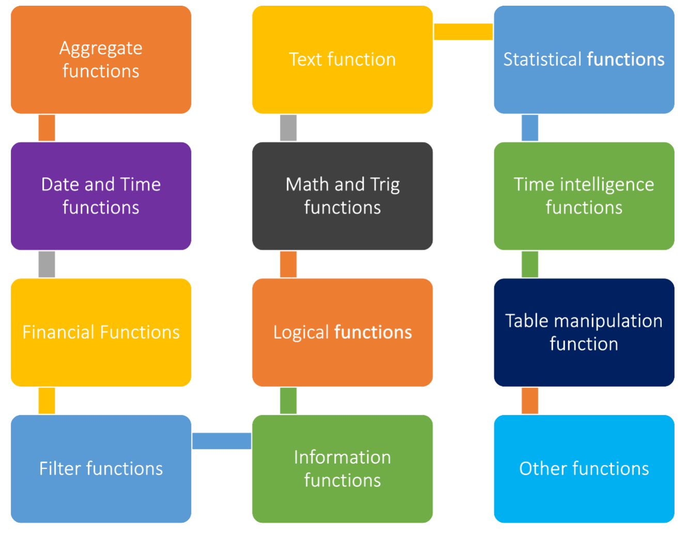
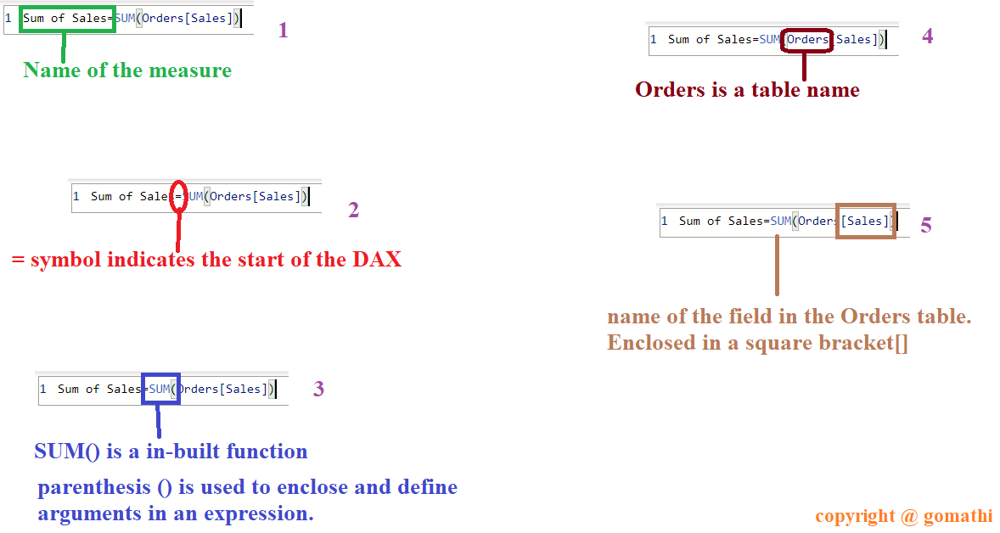

```mermaid
flowchart TB
    %% ============ THEME ============
    classDef core fill:#020617,stroke:#facc15,stroke-width:3px,color:#fef3c7
    classDef section fill:#020617,stroke:#38bdf8,stroke-width:2px,color:#e5e7eb
    classDef step fill:#020617,stroke:#a855f7,stroke-width:1.5px,color:#e0e7ff
    classDef output fill:#020617,stroke:#22c55e,stroke-width:2px,color:#dcfce7

    %% ============ ROOT ============
    A[DAX Basics - Power BI Calculation Engine]:::core

    %% ============ PREREQUISITES ============
    A --> B[Prerequisites]:::section
    B --> B1[Data Modeling Basics]:::step
    B1 --> B2[Tables Columns Relationships]:::step
    B2 --> B3[Star Schema Understanding]:::step

    %% ============ SYNTAX ============
    B3 --> C[Syntax]:::section
    C --> C1[Functions and Parentheses]:::step
    C1 --> C2[Variables VAR RETURN]:::step
    C2 --> C3[Measures vs Calculated Columns]:::step

    %% ============ FORMULA ============
    C3 --> D[Formula Logic]:::section
    D --> D1[Aggregation Functions]:::step
    D1 --> D2[Iterators SUMX AVERAGEX]:::step
    D2 --> D3[CALCULATE Logic]:::step

    %% ============ CONTEXT ============
    D3 --> E[Context]:::section
    E --> E1[Row Context]:::step
    E1 --> E2[Filter Context]:::step
    E2 --> E3[Context Transition]:::step

    %% ============ FUNCTIONS ============
    E3 --> F[Functions]:::section
    F --> F1[Logical IF SWITCH]:::step
    F1 --> F2[Time Intelligence YTD MTD]:::step
    F2 --> F3[Filter ALL FILTER VALUES]:::step

    %% ============ WHY DAX ============
    F3 --> G[Why DAX]:::section
    G --> G1[Dynamic KPIs]:::step
    G1 --> G2[Business Calculations]:::step
    G2 --> G3[Performance Optimization]:::step

    %% ============ OUTCOMES ============
    G3 --> H[Outcomes]:::output
    H --> H1[Interactive Dashboards]:::output
    H1 --> H2[Decision Ready Metrics]:::output
    H2 --> H3[Business Insights]:::output

```

<!-- ===================== REPOSITORY METRICS ===================== -->

  
  
  
  

---

# 🧮 DAX Notes – Power BI Calculations & Business Intelligence  
### *Measures • Context • KPIs • Insights*

  

---

## 📌 Introduction
This repository is a **complete DAX (Data Analysis Expressions) learning hub**, designed to explain **how calculations work inside Power BI**.  
It focuses on **practical understanding**, **visual explanation**, and **business-ready calculations**, not just syntax.

---

## 🎯 Objective of This Repository
- Understand **how DAX evaluates data**
- Learn **measures, columns, and context clearly**
- Build **dynamic KPIs and business metrics**
- Develop **decision-ready Power BI dashboards**
- Strengthen **analytical and BI thinking**

---

## 🖼️ Visual Learning Gallery (Organized)

### 🔹 DAX & Power BI Environment
<table>
  <tr>
    <td align="center">
       
      <b>Power BI Interface</b>
    </td>
    <td align="center">
       
      <b>DAX Calculation Mode</b>
    </td>
  </tr>
</table>

---

### 🔹 DAX Structure & Types
<table>
  <tr>
    <td align="center">
       
      <b>DAX Structure</b>
    </td>
    <td align="center">
       
      <b>Types of DAX</b>
    </td>
  </tr>
</table>

---

### 🔹 Syntax & Writing Style
<table>
  <tr>
    <td align="center">
       
      <b>DAX Syntax</b>
    </td>
    <td align="center">
       
      <b>Writing DAX Formulas</b>
    </td>
  </tr>
</table>

---

### 🔹 Conceptual Understanding

   
  <b>DAX Concepts Overview</b>

---

## 🔍 Analysis of DAX Notes
These notes explain:
- Difference between **Measures vs Calculated Columns**
- How **Row Context and Filter Context** work
- Why **CALCULATE** is the heart of DAX
- How **Time Intelligence** enables trend analysis
- How DAX interacts with **data models**

---

## 💡 Key Insights from the Notes
- DAX is **context-driven**, not row-by-row like Excel
- Measures are **dynamic**, recalculated per visual
- Good DAX starts with **good data modeling**
- Business KPIs require **logic, not just aggregation**

---

## 🌟 Benefits of These Notes
- ✅ Clear, visual-based learning
- ✅ Beginner to intermediate friendly
- ✅ Strong foundation for **Power BI projects**
- ✅ Ideal for **students, analysts, and educators**

---

## 🚀 Importance of Learning DAX
DAX enables:
- Dynamic dashboards
- Accurate KPIs
- Time-based analysis
- Business-driven calculations

Without DAX, Power BI dashboards remain **static and limited**.

---

## 🧠 Summary
This DAX repository is designed to help you **think like a BI professional**.  
It focuses on **logic, context, and insight generation**, enabling you to transform **raw data into meaningful business decisions**.

---

---

## 🌐 Connect With Me

  
  

---
